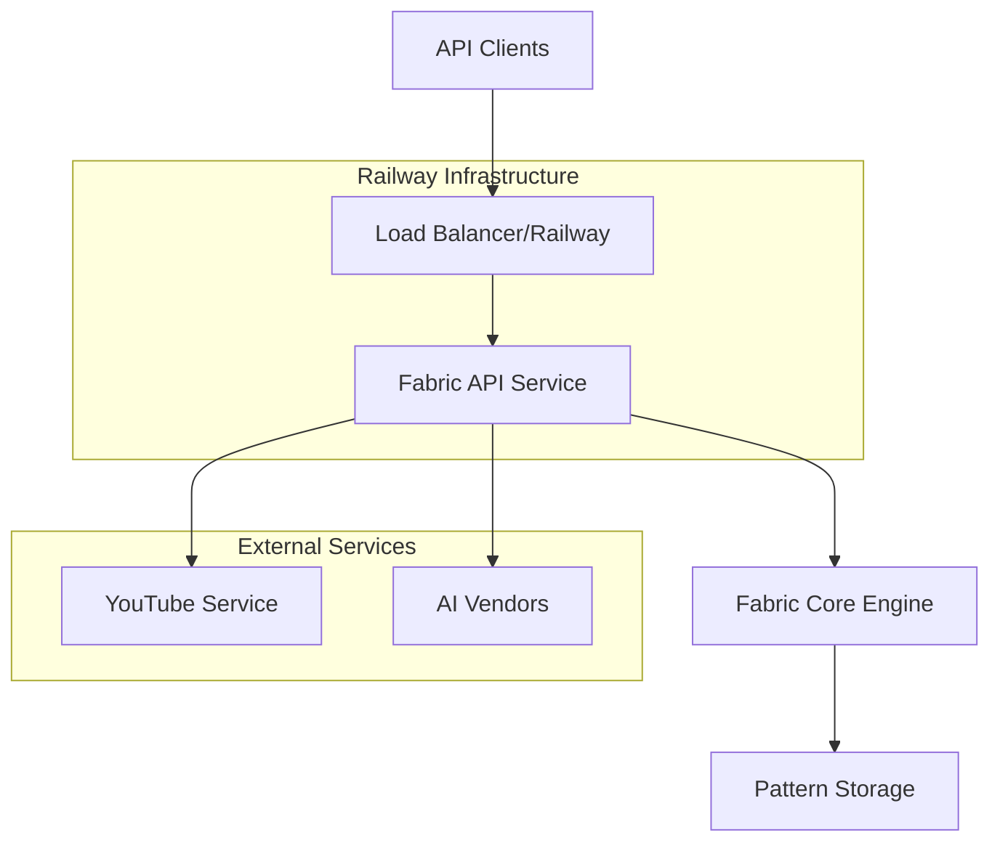

# Design Document

## Overview

The Fabric YouTube REST API is a web service that exposes Fabric's pattern-based
AI capabilities through HTTP endpoints. It enables developers to
programmatically access Fabric patterns and apply them to YouTube content. The
service will be built using Go with the Gin web framework, leveraging existing
Fabric core functionality, and deployed on Railway with a custom domain.

## Architecture

### High-Level Architecture



### Service Architecture

The API service will be structured as a lightweight wrapper around Fabric's
existing core functionality:

- **API Layer**: HTTP handlers using Gin framework
- **Service Layer**: Business logic for API operations
- **Core Integration**: Direct usage of existing Fabric internal packages
- **Configuration**: Environment-based configuration for Railway deployment

## Components and Interfaces

### 1. HTTP API Server

**Package**: `cmd/fabric-api/`

```go
type APIServer struct {
    router     *gin.Engine
    fabricCore *core.PluginRegistry
    config     *APIConfig
    logger     *log.Logger
}

type APIConfig struct {
    Port        string
    Domain      string
    APIKey      string
    RateLimit   int
    Environment string
}
```

**Key Methods**:

- `NewAPIServer(config *APIConfig) *APIServer`
- `Start() error`
- `setupRoutes()`
- `setupMiddleware()`

### 2. Pattern Service

**Package**: `internal/api/patterns/`

```go
type PatternService struct {
    registry *core.PluginRegistry
}

type PatternResponse struct {
    Name        string            `json:"name"`
    Description string            `json:"description"`
    Category    string            `json:"category"`
    Variables   map[string]string `json:"variables,omitempty"`
    Content     string            `json:"content,omitempty"`
}

type PatternsListResponse struct {
    Patterns []PatternResponse `json:"patterns"`
    Total    int               `json:"total"`
}
```

**Endpoints**:

- `GET /api/patterns` → `ListPatterns()`
- `GET /api/patterns/{name}` → `GetPattern()`

### 3. YouTube Processing Service

**Package**: `internal/api/youtube/`

```go
type YouTubeService struct {
    registry *core.PluginRegistry
    youtube  *youtube.Client
}

type ProcessRequest struct {
    VideoURL    string            `json:"video_url" binding:"required"`
    Pattern     string            `json:"pattern" binding:"required"`
    Options     ProcessOptions    `json:"options,omitempty"`
    Variables   map[string]string `json:"variables,omitempty"`
}

type ProcessOptions struct {
    Model           string  `json:"model,omitempty"`
    Temperature     float64 `json:"temperature,omitempty"`
    Stream          bool    `json:"stream,omitempty"`
    IncludeComments bool    `json:"include_comments,omitempty"`
    IncludeMetadata bool    `json:"include_metadata,omitempty"`
}

type ProcessResponse struct {
    VideoID     string      `json:"video_id"`
    Pattern     string      `json:"pattern"`
    Result      string      `json:"result"`
    Metadata    VideoMeta   `json:"metadata,omitempty"`
    ProcessTime float64     `json:"process_time_seconds"`
}
```

**Endpoints**:

- `POST /api/youtube/process` → `ProcessVideo()`
- `POST /api/youtube/stream` → `StreamProcessVideo()` (Server-Sent Events)

### 4. Middleware Components

**Authentication Middleware**:

```go
func APIKeyAuth(apiKey string) gin.HandlerFunc
```

**Rate Limiting Middleware**:

```go
func RateLimit(requestsPerMinute int) gin.HandlerFunc
```

**CORS Middleware**:

```go
func CORSMiddleware() gin.HandlerFunc
```

**Logging Middleware**:

```go
func RequestLogger() gin.HandlerFunc
```

### 5. Health Check Service

**Package**: `internal/api/health/`

```go
type HealthService struct {
    registry *core.PluginRegistry
    startTime time.Time
}

type HealthResponse struct {
    Status    string            `json:"status"`
    Uptime    string            `json:"uptime"`
    Version   string            `json:"version"`
    Checks    map[string]string `json:"checks"`
}
```

**Endpoints**:

- `GET /health` → `HealthCheck()`
- `GET /ready` → `ReadinessCheck()`

## Data Models

### API Request/Response Models

```go
// Error response format
type ErrorResponse struct {
    Error   string `json:"error"`
    Code    string `json:"code,omitempty"`
    Details string `json:"details,omitempty"`
}

// Success response wrapper
type APIResponse struct {
    Success bool        `json:"success"`
    Data    interface{} `json:"data,omitempty"`
    Error   string      `json:"error,omitempty"`
}
```

### Configuration Model

```go
type Config struct {
    Server ServerConfig `yaml:"server"`
    AI     AIConfig     `yaml:"ai"`
    YouTube YouTubeConfig `yaml:"youtube"`
    Logging LoggingConfig `yaml:"logging"`
}

type ServerConfig struct {
    Port      string `yaml:"port" env:"PORT" default:"8080"`
    Host      string `yaml:"host" env:"HOST" default:"0.0.0.0"`
    APIKey    string `yaml:"api_key" env:"API_KEY"`
    RateLimit int    `yaml:"rate_limit" env:"RATE_LIMIT" default:"100"`
}
```

## Error Handling

### Error Types and HTTP Status Codes

| Error Type          | HTTP Status | Description                   |
| ------------------- | ----------- | ----------------------------- |
| ValidationError     | 400         | Invalid request parameters    |
| AuthenticationError | 401         | Missing or invalid API key    |
| AuthorizationError  | 403         | Insufficient permissions      |
| NotFoundError       | 404         | Pattern or resource not found |
| RateLimitError      | 429         | Rate limit exceeded           |
| ProcessingError     | 422         | YouTube processing failed     |
| InternalError       | 500         | Server-side errors            |

### Error Response Format

```json
{
    "success": false,
    "error": "Pattern 'invalid_pattern' not found",
    "code": "PATTERN_NOT_FOUND",
    "details": "Available patterns can be listed via GET /api/patterns"
}
```

## Testing Strategy

### Unit Testing

- Test all service methods with mock dependencies
- Test HTTP handlers with mock HTTP requests
- Test middleware functionality
- Coverage target: 80%+

### Integration Testing

- Test complete API workflows
- Test YouTube integration with real/mock videos
- Test AI vendor integrations
- Test Railway deployment configuration

### API Testing

- OpenAPI specification validation
- Contract testing for all endpoints
- Load testing for performance validation
- Security testing for authentication and rate limiting

### Test Structure

```
internal/api/
├── patterns/
│   ├── service.go
│   ├── service_test.go
│   ├── handlers.go
│   └── handlers_test.go
├── youtube/
│   ├── service.go
│   ├── service_test.go
│   ├── handlers.go
│   └── handlers_test.go
└── testutil/
    ├── mocks.go
    └── fixtures.go
```

## Deployment Configuration

### Railway Configuration

**railway.toml**:

```toml
[build]
builder = "nixpacks"

[deploy]
healthcheckPath = "/health"
healthcheckTimeout = 300
restartPolicyType = "on_failure"

[[services]]
name = "fabric-api"
source = "."

[services.variables]
PORT = "8080"
```

### Environment Variables

| Variable            | Description            | Required | Default    |
| ------------------- | ---------------------- | -------- | ---------- |
| `PORT`              | Server port            | No       | 8080       |
| `API_KEY`           | API authentication key | Yes      | -          |
| `OPENAI_API_KEY`    | OpenAI API key         | Yes      | -          |
| `ANTHROPIC_API_KEY` | Anthropic API key      | No       | -          |
| `RATE_LIMIT`        | Requests per minute    | No       | 100        |
| `LOG_LEVEL`         | Logging level          | No       | info       |
| `ENVIRONMENT`       | Deployment environment | No       | production |

### Docker Configuration

```dockerfile
FROM golang:1.24-alpine AS builder
WORKDIR /app
COPY go.mod go.sum ./
RUN go mod download
COPY . .
RUN CGO_ENABLED=0 go build -o fabric-api ./cmd/fabric-api

FROM alpine:latest
RUN apk --no-cache add ca-certificates
WORKDIR /root/
COPY --from=builder /app/fabric-api .
COPY --from=builder /app/data ./data
EXPOSE 8080
CMD ["./fabric-api"]
```

## Security Considerations

### Authentication

- API key-based authentication for all endpoints
- Environment variable-based key management
- Optional JWT token support for future expansion

### Rate Limiting

- Per-IP rate limiting using token bucket algorithm
- Configurable limits per endpoint
- Graceful degradation under load

### Input Validation

- Strict validation of all input parameters
- YouTube URL validation and sanitization
- Pattern name validation against allowed patterns
- Request size limits

### CORS Configuration

- Configurable allowed origins
- Proper handling of preflight requests
- Secure default settings

## Performance Considerations

### Caching Strategy

- In-memory caching of pattern metadata
- YouTube transcript caching (with TTL)
- Response caching for frequently requested patterns

### Concurrency

- Goroutine-based request handling
- Connection pooling for AI vendor APIs
- Graceful shutdown handling

### Resource Management

- Request timeout configuration
- Memory usage monitoring
- Connection limit management

## Monitoring and Observability

### Logging

- Structured logging using logrus or zap
- Request/response logging
- Error tracking and alerting
- Performance metrics logging

### Metrics

- HTTP request metrics (count, duration, status)
- AI processing metrics
- YouTube API usage metrics
- System resource metrics

### Health Checks

- Liveness probe: Basic server health
- Readiness probe: Dependencies health (AI APIs, etc.)
- Custom health checks for critical components
